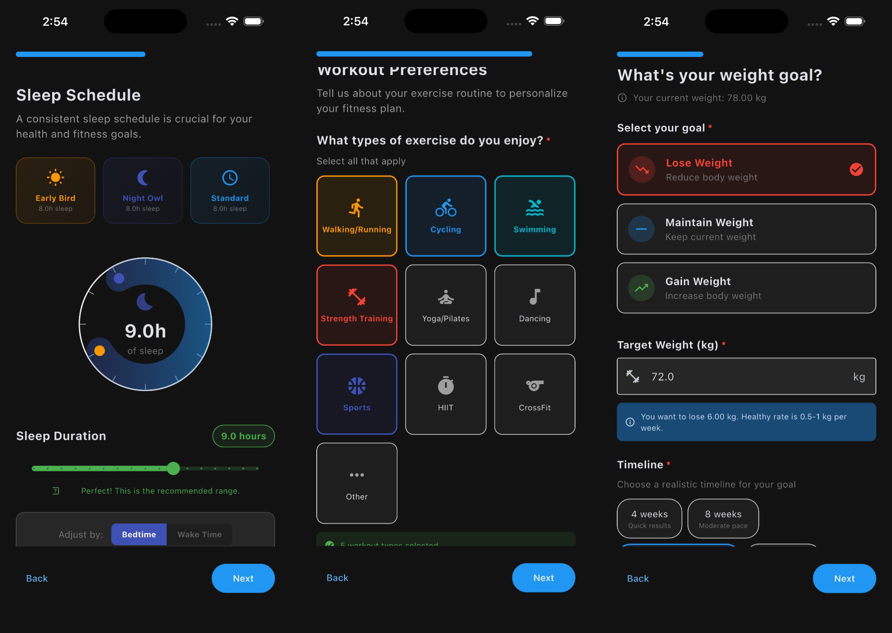
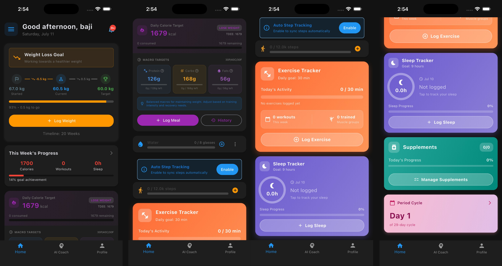
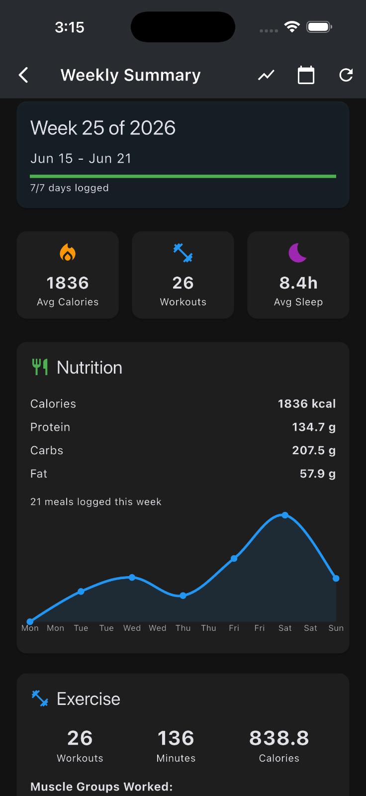
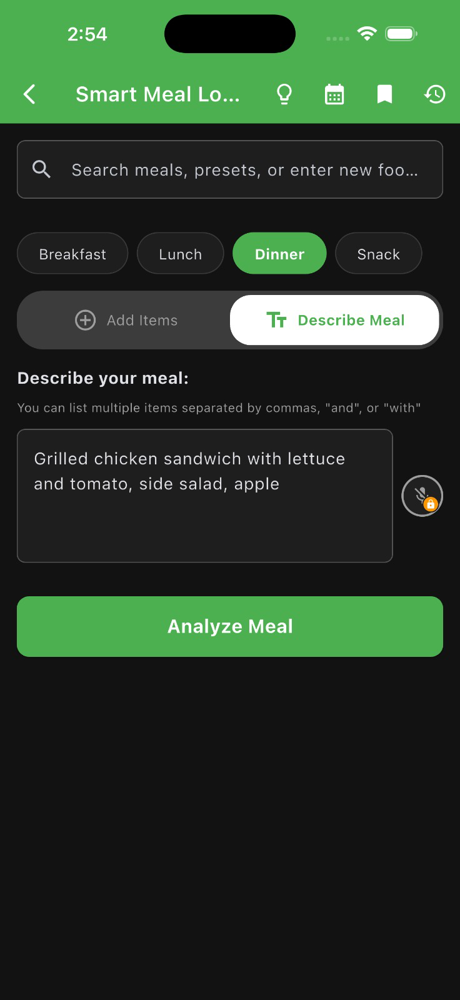
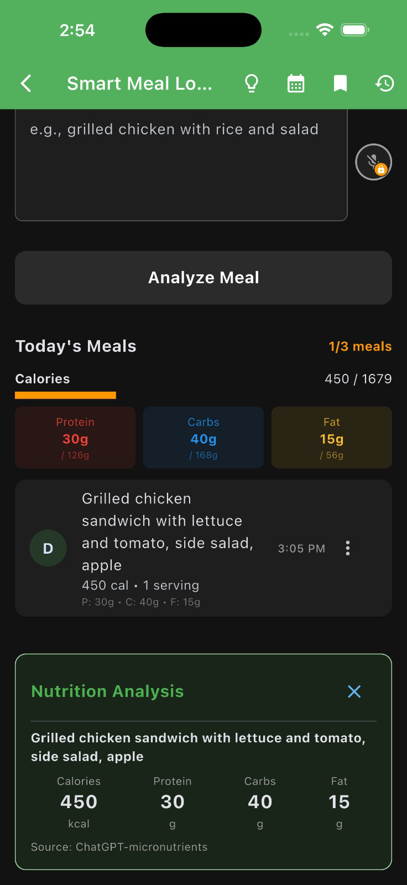
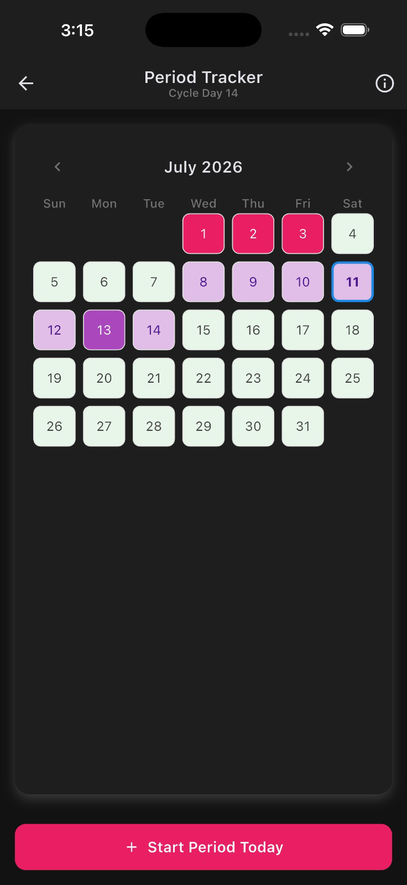
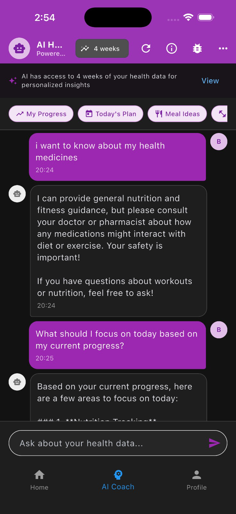

# Nufitionist

**Cross-platform AI health & fitness coach — one Flutter codebase, running on Web, Android, and iOS.**

[View Live Site (Web)](https://fitness-flutter-app.vercel.app/) · Backend repo: [nufi-ai-backend](https://github.com/ShoaibRana888/nufi-ai-backend)

| | |
|---|---|
| **Onboarding** (collage — sleep, workout, weight-goal steps) |  |
| **Dashboard** (collage) |  |
| **Weekly summary** |  |
| **Smart meal logging — input** |  |
| **Smart meal logging — AI analysis** |  |
| **Period tracker** |  |
| **AI coach chat** |  |

## Overview

Nufitionist is a health and fitness coaching app built with Flutter from a single codebase across Web, Android, and iOS. After a multi-step onboarding flow that collects goals, sleep patterns, dietary preferences, medical conditions, and workout preferences, users get an integrated ChatGPT-powered coach for personalized guidance. Native mobile builds are currently in testing ahead of an App Store / Google Play release.

## Features

- Multi-step onboarding covering goals, sleep, diet, medical conditions, and workout preferences
- ChatGPT-powered AI coach for personalized guidance
- Offline-first: data is cached locally and synced to the backend when online
- Connectivity monitoring with manual sync from the profile screen
- Customizable user profiles and fitness-tracking widgets

## Tech stack

- **Framework:** Flutter / Dart (single codebase → Web, Android, iOS, and desktop targets)
- **Backend:** [nufi-ai-backend](https://github.com/ShoaibRana888/nufi-ai-backend) — FastAPI + Supabase + OpenAI
- **Local storage:** SharedPreferences (offline support)

## Contact

**Shoaib Rana** — [shoaib.rana888@gmail.com](mailto:shoaib.rana888@gmail.com) · [Portfolio](https://portfolio-pied-two-34.vercel.app/) · [GitHub](https://github.com/ShoaibRana888)
